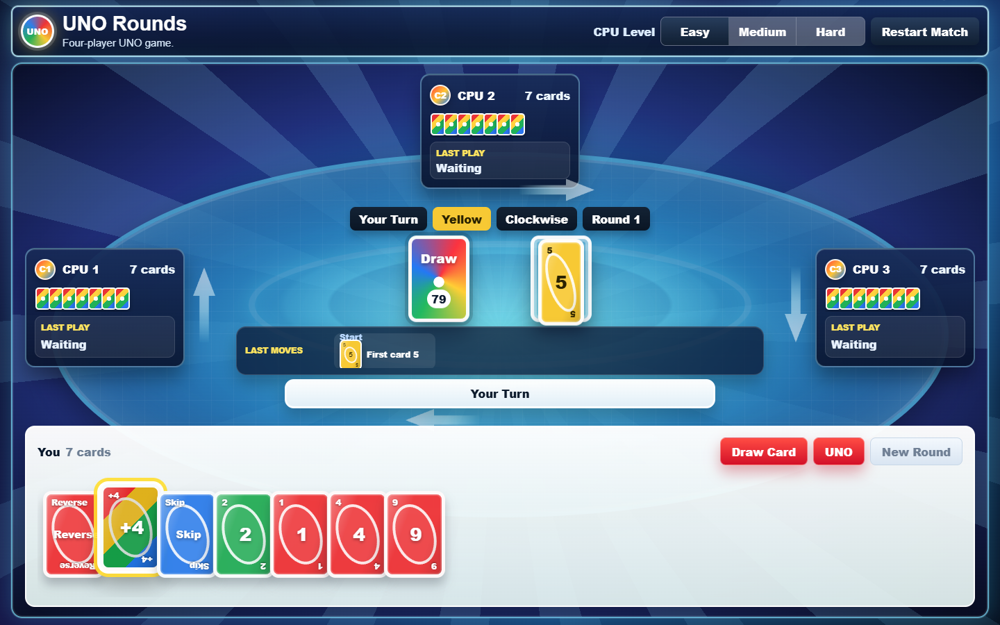

# UNO Rounds

A simple four-player, offline UNO-style browser game for kids. The game runs as a static web app with no server, account, build step, or network dependency.

## Demo

Play the hosted demo: <https://web-uno.pages.dev/>

## Run Locally

Open `index.html` in a modern browser.

The first screen waits for `Start Game`, then deals cards to:

- `You`
- `CPU 1`
- `CPU 2`
- `CPU 3`

## Project Structure

- `index.html`: page markup, SEO metadata, and game shell.
- `styles.css`: responsive table, cards, animation, and modal styling.
- `game.js`: deck rules, CPU behavior, rendering, and audio playback.
- `assets/`: favicon, README/demo screenshots, and bundled audio.
- `ASSETS.md`: third-party audio source and license notes.

## Features

- Four-player rounds with 7 starting cards per player.
- CPU levels: `Easy`, `Medium`, and `Hard`.
- Common UNO-style cards: numbers, `Skip`, `Reverse`, `+2`, `Wild`, and `+4`.
- No turn timer and no harsh UNO penalty.
- Draw button highlight when the player has no playable card.
- UNO button highlight when the player must say UNO before playing down to one card.
- Full-screen app layout with stable desktop and mobile views.
- CSS-drawn cards, table, player panels, move log, and direction arrows.
- Procedural Web Audio sounds for start, deal, play, draw, reverse, skip, wild, penalty, and loss events.
- Bundled UNO voice cue for human and CPU UNO calls.
- Bundled short victory jingle when the player wins a round.
- Basic SEO metadata, social preview tags, and SVG favicon.

## Controls

- `Start Game`: begin a new match.
- `Draw Card`: draw one card and pass the turn.
- `UNO`: say UNO when you have two cards before playing down to one card. The game gently blocks that play until UNO is called.
- `New Round`: appears after a round ends.
- `Restart Match`: clears the match and returns to the start screen.

## Notes

This is an UNO-inspired private single-player game. It does not use official UNO, Mattel, Ubisoft, or other commercial game assets, logos, art, or audio. Bundled audio files are from free-to-use sources and are documented in `ASSETS.md`; the code and original project artwork remain under this repository's license.

The game intentionally exposes a small `window.__colorCardGame` helper only when opened from `file:`, `localhost`, or `127.0.0.1`. This keeps browser-based QA simple without exposing a debug API on the public demo site.

## QA Completed

The latest QA pass covered:

- Four-player turn order.
- `Reverse`, `Skip`, `+2`, `Wild`, and `Wild +4` behavior.
- Draw pile refill from discard pile.
- `Easy`, `Medium`, and `Hard` CPU selection differences.
- Start screen with no cards dealt before `Start Game`.
- Round-end modal contrast and buttons.
- Desktop, mobile, tablet, wide, and ultrawide layout checks.
- No scoreboard DOM, no body scrollbars, and no visible move-log scrollbar.
- Stable board, hand, message, and move-log dimensions while cards are played.
- English-only game UI text.
- Web Audio context activation after the first user click.
- UNO prompt, UNO button highlight, CPU UNO calls, and the gentle "Tap UNO first!" block.
- Bundled UNO voice and victory jingle playback with Web Audio fallback behavior.
- README screenshot, favicon, and page metadata.
